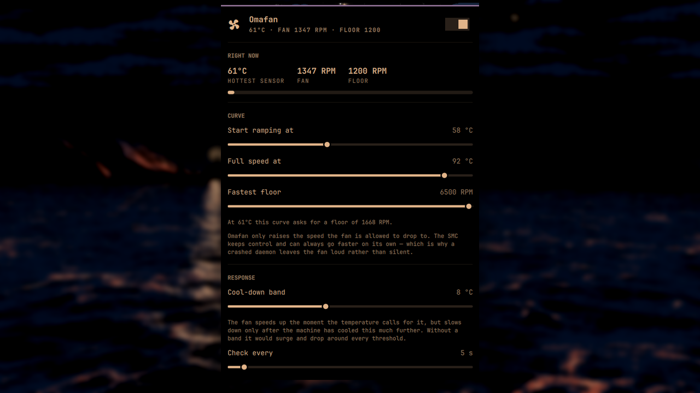

# Omafan

Temperature-driven fan control for Apple hardware running Linux, configured
from the Omarchy bar.

macOS ran a userspace daemon that watched the temperature and leaned on the
fan. Linux does not, and the SMC's own fallback curve is far too patient. The
bar shows you the temperature; Omafan keeps it from getting there.



## The measurement this exists for

On the MacBookAir7,2 it was written on, 45 seconds of four-thread load:

| | t+0s | t+15s | t+30s | t+45s |
|---|---|---|---|---|
| CPU package | 67 °C | 81 °C | 84 °C | **90 °C** |
| Fan | 1187 RPM | 1206 RPM | 1192 RPM | **1193 RPM** |

The fan never moved. The SMC will eventually do something about 90 °C, but
"eventually" is well into the nineties, and the CPU throttles at 105 °C. That
gap is the whole product.

## Defaults

| Setting | Value |
|---|---|
| Start ramping at | 65 °C |
| Full speed at | 92 °C |
| Fastest floor | 6500 RPM (the hardware maximum) |
| Cool-down band | 8 °C |
| Check every | 5 s |

Between the two temperatures the floor is linear — about 196 RPM per degree.
Below the first the fan is left at its factory floor and the machine is silent.

These are calibrated for the machine above, which rests in the low-to-mid
sixties. A threshold under 65 °C there means the fan works during ordinary
browsing and never stops, which is how you end up with a laptop that is cool,
audible from the next room, and wearing out its only moving part.

## Using it

The bar shows the hottest tracked sensor. Click the icon for the panel;
right-clicking it turns the curve off and on without opening anything.

## Install

```bash
omarchy plugin add https://github.com/heroesofcode/omafan --enable
```

The curve is driven by a small root daemon under systemd, because writing to
the fan needs root. This is the only step that does:

```bash
sudo ~/.config/omarchy/plugins/io.github.heroesofcode.omafan/omafan-install
```

### What it needs

Apple hardware with the `applesmc` module loaded, Omarchy 4, and `jq`, `sed`,
`grep` and `systemctl` — all of which already ship with Omarchy, so there is
nothing extra to install.

### What has actually been tested

Everything here was written and measured on a **MacBookAir7,2**: one fan,
`applesmc.768`, `coretemp` for the package temperature.

The hardware discovery is deliberately generic — it globs for
`/sys/devices/platform/applesmc.*`, picks up every `fan[0-9]*_min` it finds,
and drives all of them from the same curve — so a two-fan MacBook Pro should
work. That path has never run on real hardware. If you are the first, check it
with `omafan-doctor`, which reports the RPM the fan is actually turning rather
than what the config says it should be.

The failure mode is deliberately the safe one. Omafan only ever raises
`fan1_min`, the floor the SMC is allowed to idle at, and never touches
`fan1_manual`. The SMC's own curve stays in circuit the whole time, and if this
daemon dies the fan holds its last floor — loud at worst, never silent under
load.

Everything after that is unprivileged. The panel writes
`~/.config/omafan/config`, and the daemon re-reads it on its next tick — no
password, no restart, no `systemctl`.

Re-run the installer after a plugin update; `omafan-doctor` will tell you when
the installed copy has fallen behind.

## From a terminal

```bash
./omafan-status                       # one line of JSON: temperature, RPM, floor
./omafan-doctor                       # check the chain from module to actual RPM
./omafan-apply '{"tempLow":55}'       # partial objects are fine
./omafan-apply --print                # show what would be written, write nothing
```

`omafan-apply` is the only thing that writes the config file. The panel
rewrites it from its own saved settings the next time anything changes, so
terminal edits are for trying things out, not for persisting them.

## How it reaches the fan

`applesmc` exposes `fan1_min`, `fan1_max`, `fan1_manual` and `fan1_output`.
Omafan writes **`fan1_min` only**, and never touches `fan1_manual`.

That means it does not take control of the fan. It raises the speed the fan is
allowed to drop to, and the SMC goes on governing everything above that.

The choice is about what happens when the daemon is not there:

- **Raising the floor:** the fan holds its last floor. Loud at worst. The SMC's
  own curve is still in circuit, so a real emergency is still handled.
- **Taking manual control:** the fan holds its last *output*. If that was a low
  RPM and the machine is under load, nobody is left to raise it.

The first failure mode is a noisy laptop. The second is a hot one. `mbpfan`,
the usual tool here, takes manual control; Omafan does not.

## Uninstall

```bash
sudo ~/.config/omarchy/plugins/io.github.heroesofcode.omafan/omafan-install --uninstall
omarchy plugin disable io.github.heroesofcode.omafan
```

The daemon restores the factory floor when it stops, so uninstalling leaves the
fan exactly as Omafan found it.

## Tests

```bash
./tests/run              # everything, about half a minute
./tests/run hysteresis   # only the tests whose name contains this
```

No CI runner has Apple hardware in it, so the suite builds a fake one: a
temporary directory holding an `applesmc` platform device with writable fan
floors, a `coretemp` hwmon, and a couple of hot sensors that are supposed to be
ignored. Every script reads sysfs and the unit file through `$OMAFAN_SYSROOT`,
empty in production, so they run against that tree unmodified.

Two layers, because they catch different things. The daemon is **sourced**,
which yields its discovery and its functions with no loop attached, and the
curve, the clamps and the hysteresis band are then called directly with the
values that once went wrong — the floor that parked at 2966 RPM among them.
Then it is **run** against the fake tree with the temperature moved underneath
it, which is the only way to see that a floor is really written, that a
two-fan machine gets both, and that stopping the service puts the factory
floor back.

One test exists only to keep the four copies of the defaults — `manifest.json`,
`Model.js`, `omafan-apply` and the daemon — from drifting apart. They are
duplicated on purpose, because each has to work when the others have not
spoken, and nothing but that test makes them agree.

`shellcheck` and the suite run on every pull request, on Arch, which is what
Omarchy is.

## Releasing

Versions are not edited by hand. release-please watches `main`, reads the
commit messages, and keeps a release pull request open with the next version
number and a generated `CHANGELOG.md`. Merging that PR tags the release and
publishes it.

So commit messages decide the version, and they follow
[Conventional Commits](https://www.conventionalcommits.org):

| Prefix | Effect |
|---|---|
| `fix:` | patch bump — 1.0.0 to 1.0.1 |
| `feat:` | minor bump — 1.0.0 to 1.1.0 |
| `feat!:` or a `BREAKING CHANGE:` footer | major bump — 1.0.0 to 2.0.0 |
| `refactor:` `perf:` | patch bump, shown in the changelog |
| `docs:` `ci:` `test:` `chore:` | no bump, not in the changelog |

`manifest.json` is bumped by release-please through the `extra-files` rule in
`release-please-config.json`; `.release-please-manifest.json` is where it
remembers the current version. Neither is meant to be edited by hand.

Pull requests are merged with **rebase**, so every commit message lands on
`main` verbatim and every one of them is parsed. A stray `wip` commit in a
branch becomes a stray `wip` commit in the history — squash locally first, or
switch the repository to squash-merge so only the PR title counts.

## Things that are true and not obvious

**`fan1_min` really does move the fan, with `fan1_manual` still `0`.** This is
the load-bearing fact and it was verified twice, by separate runs: writing
`3500` took the measured `fan1_input` from 1202 to ~3500 RPM within three
seconds and it held there; restoring `1200` dropped it back. A driver accepting
a write and a fan changing speed are two different things, and only the second
one matters.

**The factory floor cannot be read once Omafan is running.** `fan1_min` is
where Omafan writes, so after the first tick it reports Omafan's floor, not the
hardware's. The installer captures the stock value *before* enabling the
service and records it in the unit as `OMAFAN_STOCK_MIN`; that record is what
the daemon restores on stop and what a reinstall reuses. Without it, every
reinstall would enshrine the current floor as "stock" and the fan would never
come back down.

**Hysteresis that compares against a shifted temperature is a bias, not a
band.** The tempting way to stop the fan oscillating is: when the curve asks
for less than the current floor, compare against `floor_for(temp +
hysteresis)`. It has a fixed point. As soon as that expression equals the
current floor, nothing can ever lower it again, and the machine runs forever as
though it were `hysteresis` degrees hotter than it is — observed here as a
floor parked at 2966 RPM for minutes with the CPU at 66 °C and the curve asking
for 1396. The band has to be measured against the temperature at which the
current floor was *chosen* (`ANCHOR` in the daemon), and crossing it has to
apply the real target. Then it is a deadband.

**`systemctl enable --now` does not restart a running service.** Re-running
the installer to deploy a fixed daemon copied the new file into place and left
the old process running — and because `omafan-doctor` compares the installed
*file* against the plugin's, it reported the two as matching while the fan was
obeying code that no longer existed on disk. The only thing that caught it was
the effect check disagreeing with the curve. The installer uses `restart` now.

**Anything that reads `fan1_min` as "the hardware minimum" is a ratchet.**
This is the same trap as the paragraph above about the installer, and it was
worth falling into twice to notice: `omafan-apply` clamped `rpmMin` against
whatever `fan1_min` held, which once the daemon is running is the *current
floor*. Every save therefore raised the lower end of the curve to wherever the
fan happened to be, until `rpmMin` and `rpmMax` met and the curve was a
horizontal line at 5800 RPM — a fan at near-full speed that no temperature
could bring down. Read the recorded stock value, never the live file.

**`jq`'s `//` treats `false` as missing.** `.[$k] // empty` is the idiomatic
way to ask jq for an optional key, and it was quietly wrong here: `//` takes
the right-hand side for `false` as much as for `null`. So `{"enabled":false}` —
which is exactly what the panel's off switch sends — read as *absent*, fell
back to the default, and wrote `enabled=1`. The bar said the curve was off
while the daemon went on driving the fan. Ask `has($k)` instead. The test suite
found this; a year of using it would not have, because the only symptom is a
fan that keeps working when you told it not to.

**`applesmc`'s hwmon node is empty.** `/sys/class/hwmon/hwmonN` for this driver
has no `name` file and no `temp*_input` at all — the attributes hang off the
platform device. Anything that discovers sensors by walking hwmon and matching
`name` will find `coretemp` and silently miss every Apple sensor. Resolve
`/sys/devices/platform/applesmc.*` instead. The `.768` suffix is not stable.

**Most of the 33 Apple sensors are useless for a fan curve.** Measured across
that same load: the CPU die sensors and coretemp's package all moved together,
`TC1C` +27 °C, `TC2C` +26, `TCMX` +26, `TCXC` +25, `TC0F` +23, package +23,
`TCGC` (GPU) +21. Meanwhile memory (`TM0P`) moved +3, and the SSD and skin
sensors (`TH0V`, `Ta0P`, `Th1H`, `Ts0S`) moved +1. Omafan tracks the package
plus `TCGC`/`TCXC`/`TCMX`, which covers both heat sources without reading 33
files every tick.

**An old MacBook idles much hotter than you expect.** The 67 °C in the table
above was *before* the load test, with a load average around 1.4 — not an idle
machine, but not a busy one either. Look at the number in the bar for a while
before deciding that a 60 °C ramp threshold is too aggressive. It probably
isn't.

**The daemon is deliberately not run from `~/.config`.** A root service whose
`ExecStart` points into your home directory means any process running as you
can rewrite what root executes. `omafan-install` copies the daemon to
`/usr/local/lib/omafan/` owned by `root:root`. The cost is that a plugin update
does not update the daemon until you re-run the installer, which is why
`omafan-doctor` compares the two copies and says so.

**The service keeps almost none of root's privileges.** It runs as root for
exactly one reason — writing `fan*_min` under `/sys` — so the unit gives back
everything else: an empty `CapabilityBoundingSet`, `NoNewPrivileges`,
`ProtectSystem=strict`, `ProtectHome=read-only`, no network namespace, and a
`@system-service` syscall filter. `ProtectKernelTunables` is pointedly *not*
set: it would mount `/sys` read-only, which is the one thing this daemon exists
to write, and the breakage would be silent — the service would start, the curve
would compute, and the fan would never move.

**The config file is user-writable on purpose, and that is safe.** It is read
by a root process, so it is parsed with a whitelist of integer keys — never
sourced — and every value is clamped against what the hardware reports before
it is used. The worst a tampered config can do is ask for a fan speed the fan
already supports.

**`thermald` is running and is not a conflict.** It throttles the CPU; it does
not drive Apple fans. Both can run. If the machine still hits its limits with
Omafan at full speed, `thermald` is what keeps it safe.

**`grep -q` in a `pipefail` pipeline reports failure.** `lsmod | grep -q
applesmc` returns non-zero under `set -o pipefail`: `grep` exits at the first
match, `lsmod` dies of `SIGPIPE`, and `pipefail` surfaces that. The first
version of `omafan-doctor` confidently reported the module as not loaded while
it was loaded. Read `/proc/modules` directly, and let `sed` quit on its own
rather than having `head -1` close the pipe underneath it.
